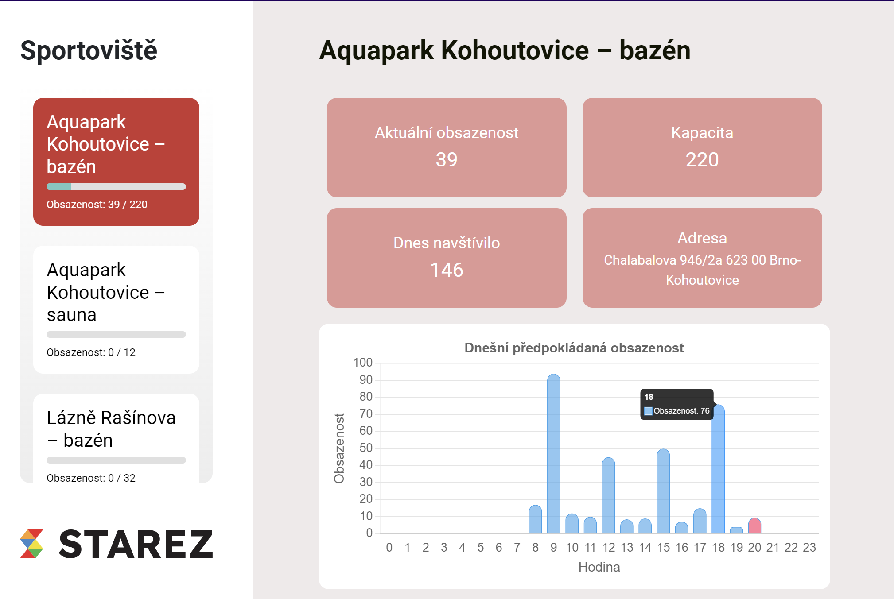

# BIT_Hack 2024 (hackathon)
This repository contains code tasks for the *BIT_Hack* hackathon, created in 2024. With our solution, we won first place in the Data Master category. 🚀🏆

- **Team**: Team Hackson
- **Category**: Data Master
- **Assignment Authors**: data.Brno
 
## App Preview

## Team Members
- David Chocholatý
- Filip Bučko
- Tomáš Bártů
- Šimon Šmída
